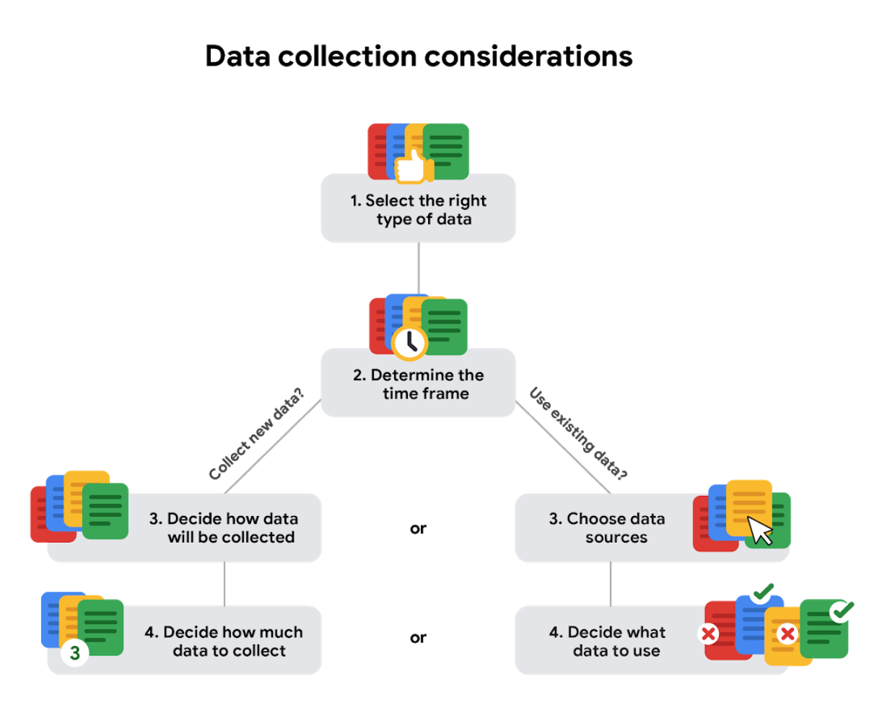

# Data Analytics
We first have to understand that data analysis and data analytics is not the same.
Data analytics comprehends the science of data. We can understand data analytics as an umbrella that covers the whole **data** subject, whereas data analysis tries to answer existing questions about data, and transform those answers into insights that support **data-driven** decisions and strategies.
Normally, these decisions and strategies are validated with subject matter experts, who are aware of the bussiness processes and can verify whether a decision makes sense or not.

As a Data Analyst, you have the ability to empower businesses to incorporate **data-driven** culture, and so, you are supossed to:
- **##Ask:** Make useful and relevant questions that can help you to either understand the problem you're facing or find actual ways to dive into available data and information.
- **##Prepare:** 
Once you've asked relevant questions about the problem you're trying to face using data analysis, collection and storage of that data should be defined here.

The first defined step regards **data collection**. In order to collect data, you'll have to take certain aspects into account:
- **How the data will be collected:** We have the option to collect data by ourself (first-party) or to obtain it from another party (generally, data is bought).
    - **How much data to collect:**
    We must decide an appropiate data amount that is relevant to the project's needs, and so, definining the appropiate size of the samples we may use in data analysis.
    - **Collection time frames:**
    If you are collecting your own data, deciding an appropiate time frame that represents the situation we want to analyze, is key to ensure our analysis is relevant to the problem.
- **Data sources:** If you are going to obtain data that was collected by certain organization or person, then we can defin this as **second-party** data, but, if the data was collected by a different party and shared with us by a party we know, then we can define this data source as **third-party data.**
- **Solving your business problem:** Once data is obtained, we need to make sure we've identified the most relevant data to the problem we are trying to solve.
- **Time frame:**
Sometimes, the time frame available to collect or process data is not very long or relevant. At those cases, we want to select a time frame that represents the behavior of the data variables in the situation we want to deep in.

- **##Process:** It involves every necessary process that allows us as analysts to clean our data and so, make it meaningful
- **##Analyze:** Using tools such as Python, R, Tableau and SQL, are you able to find any behaviour in the data you're processing so far? What are your conclusions?
- **##Share:** It involves being effective when showing those insights to the stakeholders involved in the project you're working for.
- **##Act:** Although we do have to analyze data using technical skills, action and collaboration with different areas, depending on the project we're working on, is actually the most important part of the work. This is the moment when decisions are made and become data-driven.

## Skills
This work flow is normally accompanied by a set of skills you'll need to have in order to actually solve problems with data analysis:

 - **Curiosity:** This is the ability to wonder when no one else is asking. To get interested in things that hide data impact and actually understand their potential.
 - **Understanding context:** Being aware of the context of the problem we're trying to solve is key to actually finding insights. Understanding why data shows what it shows makes the data even more meaningful and clear.
 - **Technical mindset:** It is about how logical are your actions when approaching problems (specially their data sets) It is about how effective you are using the neccesary tools to clean, transform and actually use data.
 - **Data design:** How effective you are when it comes to structure data in order to make analysis easier and more insightful.
 - **Data strategy:** Last, but not least, data strategy is about the managment of the people, processes and tools used in data analysis. What kinds of tools will you use? Why (what proccess is supposed to be completed next and why is the tool we are going to use the most adequate one)?
 *(Google)*
## Data-lifecycle
Just like human beings, data has its own life cycle as well.
This means, we can describe different stages when we process and use data:
- ***Plan:*** It is about deciding what kind of data is needed and how will we manage it. Normally, in this stage, the responsible person of this data is defined.
- ***Capture:*** It regards deciding how is the process to collect data going to work, techniques and protocols of data collection are defined here.
- ***Manage:*** This step is about how will we maintain the data and how will we storage it (tools? people? technologies?).
- ***Analyze:*** Use the data to solve problems, make decisions, and support business goals.
- ***Archive:*** Keep relevant data stored for long-term and future reference.
- ***Destroy:*** Remove data from storage and delete any shared copies of the data.

## Types of problems solved using Data Analysis:
Analyzing data is more than just plugging information into a platform in order to find insights. We analyze data in order to solve a problem, and the way we approach whose problems depends on the type of problem we are facing.
According to Google, there are six different types of problems we generally face:
- **Making predictions:** Stakeholders are interested in making predictions of the product or service they produce/serve so that actions can be taken to increase the project's success. We as data analysts cannot guarantee future results, but we can predict the future product behavior based on the available data.
- **Categorizing things:** In this type of problem, there is a need to classify or identify the objects or things the data is describing (this categorization depends on the context of the questions asked in the ask phase) so we can relate those categories to each set of data available and act based on the findings.
- **Spotting something unusual:** There are certain contexts in which anomalies play a very important role. Detecting of these anomalies becomes crucial, and we can use data analysis to capture them.
- **Identifying themes:** Some UX designers might rely on data analysts to identify themes to help prioritize the right product features for improvement.
- **Discovering Connections:** It is about how data analysts can use their capabilities to understand the impact of a party's actions in a multy-party relationship on the results that their cooperation aims to achieve.
This leads to improved ways in which correlated actions drive better results for the project the parties are working on.
- **Finding Patterns:** This is about finding correlations between variables whose state or value impacts the behavior of other variables. Sometimes, the way  a variable behaves affects an specific result in the most of cases.
For example, imagine an insight obtained from maintenance data, where we concluded that most of system failures happen when maintenance windows are delayed by more that 7 days.
